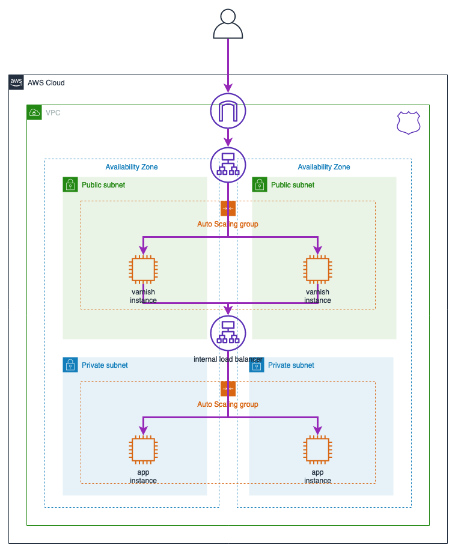
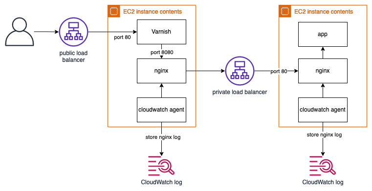

# aws-sample-cdk-varnish
AWS Sample: Varnish layer architecture proof of concept.

## Architecture

The architecture is shown as below. The varnish instances are located
in the public subnets behind a public load balancer. The app instances
are located in the private subnets behind a private load balancer.



The varnish instance contains 2 daemon: Varnish and Nginx. The reason behind this is because Varnish is not compatible with Amazon Elastic Load Balancer. (See this article for reason [ Using Varnish Proxy Cache with Amazon Web Service ELB Elastic Load Balancer ](http://blog.domenech.org/2013/09/using-varnish-proxy-cache-with-amazon-web-services-elastic-load-balancer-elb.html)).

The private load balancer will be masked with private DNS name to simplify the Nginx configuration.



Instead of storing the long DNS of the load balancer, we can easily use the private DNS name.
```conf
        location / {
            # We use internal domain name to mask the internal load balancer.
            proxy_pass  http://app.internal.prod;
            proxy_set_header Host $http_host;
        }
```
## Requirements

This application requires
- AWS CDK. Tested in version 1.114

## Deploying

To deploy the stack, execute

```
cdk deploy
```

## Cleaning Up

To clean up the resource, plus you need to empty the log bucket.

```
```

